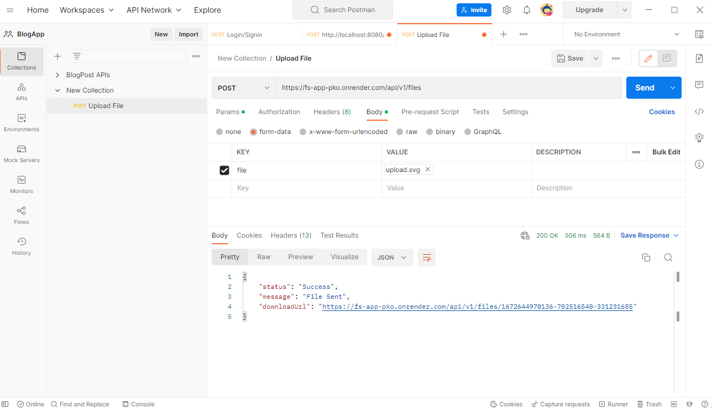
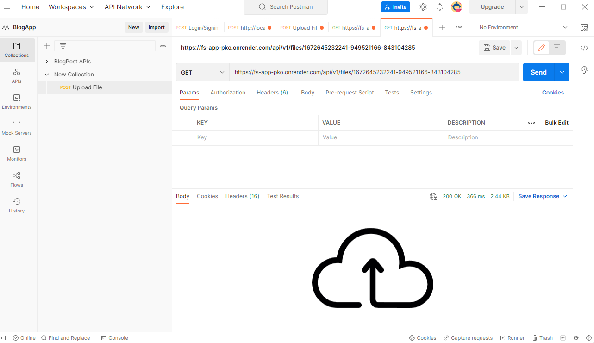

# FS-App-Backend

This app allows a user to **upload any file to DB** and then the user will get a **download link** using which anyone can download that file.

# Tech Stack

1. **NodeJS**
2. **MongoDB**
3. **ExpressJS**
4. **Multer**

# Hosting

The project is hosted on **render.com** at https://fs-app-pko.onrender.com

# Routes

1. https://fs-app-pko.onrender.com/api/v1/files : for **POST** request to upload a file

Once we upload a file we get the **download Url** in response using which we can download the file

2. https://fs-app-pko.onrender.com/api/v1/files/:fileId: to download a file with **fileId=fileId**

We can see the file downloaded in reponse

# How to use:

1. Simply create a clone of the project on your local machine.

2. Then you will need to change the necessary env variables as well as setup MongoDB.

3. Then build the project using **npm run install** to download dependencies in package.json

4. Use **npm run start**

# Limitations

Since I am hosting the project on free service. So there is limitation on DB space as well as hosting limitations. So I have implemented some limitations.

1. **File-size**: the user cannot upload a file with size above **10KB**

2. **Regular-deletion of file**: The files will be stored in DB for only 10 minutes after which it will be deleted. I have setup **TTL index** in Mongo-Schema (models/files.js)

3. **Rate-Limiter**: A user is not allowed to make more than 5 request in 10 minutes window
